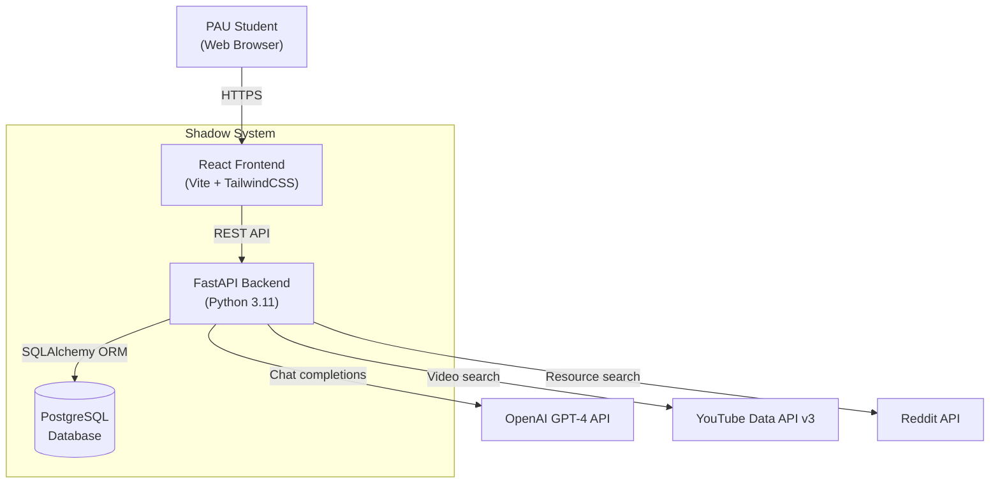
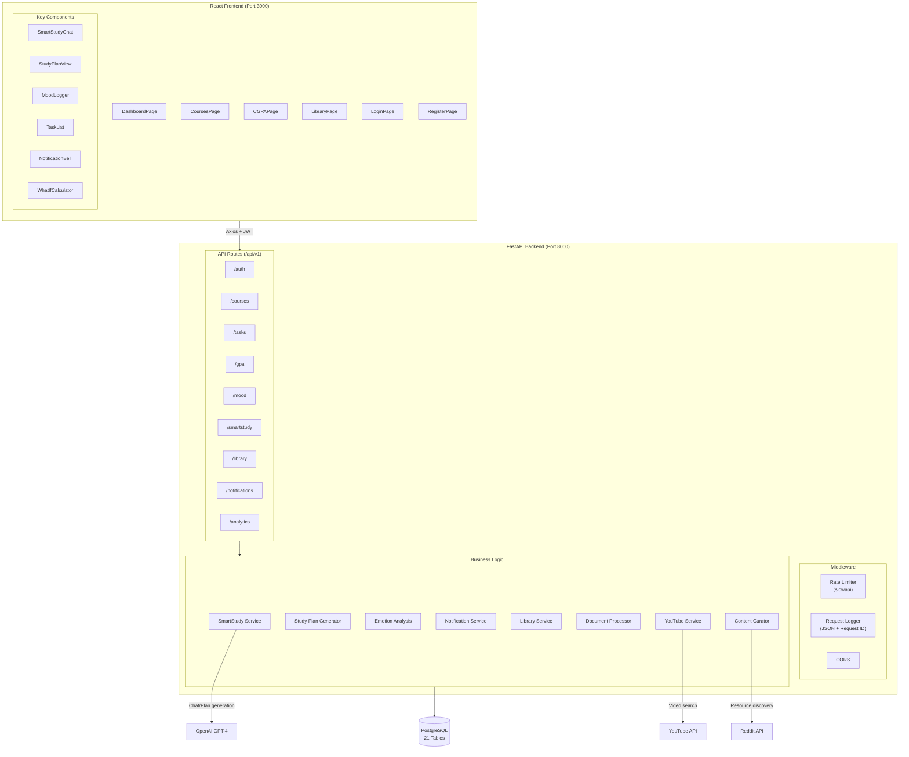
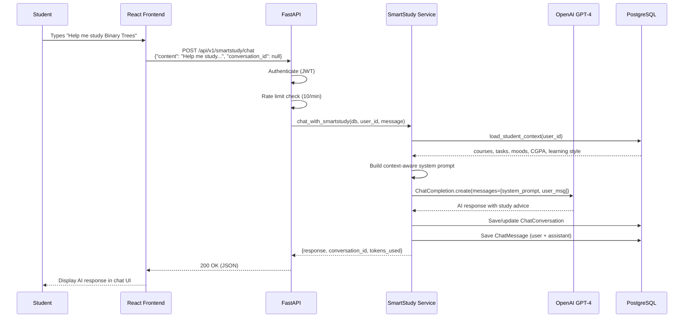
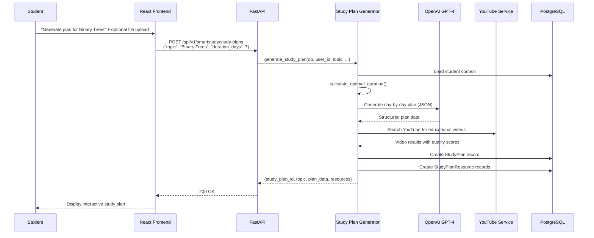

# Shadow - System Architecture

## 1. System Context (C4 Level 1)

High-level view of Shadow and its external dependencies.

## 2. Container Diagram (C4 Level 2)

Detailed view of frontend pages, backend routes, and services.

## 3. SmartStudy Chat Flow (Sequence Diagram)

End-to-end flow when a student sends a message to SmartStudy AI.

## 4. Study Plan Generation Flow

## 5. Data Model (ERD)

All 21 database tables and their relationships.

```mermaid
erDiagram
    users {
        uuid id PK
        string email UK
        string full_name
        string university_id
        string entry_level
        decimal target_cgpa
        decimal current_cgpa
    }

    courses {
        uuid id PK
        string code UK
        string title
        int credits
        string semester
        string level
    }

    user_courses {
        uuid id PK
        uuid user_id FK
        uuid course_id FK
        decimal ca_score
        decimal exam_score
    }

    tasks {
        uuid id PK
        uuid user_id FK
        uuid course_id FK
        string title
        string priority
        datetime due_date
        boolean is_completed
    }

    mood_logs {
        uuid id PK
        uuid user_id FK
        string mood
        int energy_level
        text note
    }

    chat_conversations {
        uuid id PK
        uuid user_id FK
        string title
    }

    chat_messages {
        uuid id PK
        uuid conversation_id FK
        string role
        text content
        int tokens_used
    }

    study_plans {
        uuid id PK
        uuid user_id FK
        uuid course_id FK
        string topic
        json plan_data
        decimal completion_percentage
        boolean is_active
    }

    study_plan_resources {
        uuid id PK
        uuid study_plan_id FK
        string resource_type
        string resource_url
        boolean clicked
        boolean completed
        int helpful_rating
    }

    video_notes {
        uuid id PK
        uuid user_id FK
        uuid resource_id FK
        text content
        int timestamp_seconds
        string note_type
    }

    library_documents {
        uuid id PK
        uuid course_id FK
        uuid uploaded_by FK
        string topic
        string file_name
        string file_type
        int helpful_votes
    }

    library_votes {
        uuid id PK
        uuid user_id FK
        uuid document_id FK
        int vote_value
    }

    notifications {
        uuid id PK
        uuid user_id FK
        string title
        string notification_type
        string priority
        boolean is_read
        boolean is_dismissed
    }

    notification_preferences {
        uuid id PK
        uuid user_id FK
        boolean task_reminders
        boolean mood_check_reminders
        boolean email_enabled
    }

    scheduled_reminders {
        uuid id PK
        uuid user_id FK
        string reminder_type
        datetime scheduled_time
        boolean is_recurring
        boolean is_active
    }

    uploaded_documents {
        uuid id PK
        uuid user_id FK
        string file_name
        boolean analyzed
    }

    intervention_outcomes {
        uuid id PK
        uuid user_id FK
        uuid study_plan_id FK
        decimal before_score
        decimal after_score
        decimal grade_improvement
    }

    content_quality_scores {
        uuid id PK
        string content_type
        string content_id UK
        decimal quality_score
    }

    curated_resources {
        uuid id PK
        string topic
        string resource_type
        decimal quality_score
    }

    content_curation_queries {
        uuid id PK
        string topic
        int result_count
    }

    semesters {
        uuid id PK
        string name
        date start_date
        date end_date
    }

    users ||--o{ user_courses : enrolls
    users ||--o{ tasks : creates
    users ||--o{ mood_logs : logs
    users ||--o{ chat_conversations : has
    users ||--o{ study_plans : generates
    users ||--o{ notifications : receives
    users ||--o{ notification_preferences : configures
    users ||--o{ scheduled_reminders : schedules
    users ||--o{ library_documents : uploads
    users ||--o{ library_votes : casts
    users ||--o{ video_notes : writes
    users ||--o{ uploaded_documents : uploads
    users ||--o{ intervention_outcomes : tracked

    courses ||--o{ user_courses : has
    courses ||--o{ tasks : categorizes
    courses ||--o{ library_documents : contains
    courses ||--o{ study_plans : targets

    chat_conversations ||--o{ chat_messages : contains

    study_plans ||--o{ study_plan_resources : includes
    study_plans ||--o{ intervention_outcomes : measures

    study_plan_resources ||--o{ video_notes : annotated

    library_documents ||--o{ library_votes : receives
```

## 6. Technology Stack

| Layer | Technology | Purpose |
|-------|-----------|---------|
| **Frontend** | React 18 + Vite 5 | UI framework + build tool |
| **Styling** | TailwindCSS 3 | Utility-first CSS |
| **Charts** | Recharts | CGPA visualizations |
| **HTTP Client** | Axios | API communication with JWT interceptors |
| **Backend** | FastAPI 0.120 | Async Python web framework |
| **ORM** | SQLAlchemy 2.0 | Database abstraction |
| **Migrations** | Alembic | Schema version control |
| **Auth** | python-jose + bcrypt | JWT tokens + password hashing |
| **AI** | OpenAI GPT-4 | Chat + study plan generation |
| **NLP** | Transformers (HuggingFace) | 7-emotion detection |
| **Database** | PostgreSQL | Production data store |
| **Rate Limiting** | slowapi | API abuse prevention |
| **Logging** | python-json-logger | Structured JSON logs |
| **Testing** | pytest + Vitest | Backend + frontend testing |
| **Security** | Bandit | Static analysis |
| **CI/CD** | GitHub Actions | Automated testing pipeline |

## 7. PAU Grading System

Shadow implements Pan-Atlantic University's specific grading rules:

| Grade | Points | Score Range |
|-------|--------|-------------|
| A | 5.0 | 70-100 |
| B | 4.0 | 60-69 |
| C | 3.0 | 50-59 |
| D | 2.0 | 45-49 |
| E | 1.0 | 40-44 |
| F | 0.0 | 0-39 |

**Assessment Split:** 35% CA (30 marks assessments + 5 marks participation) / 65% Exam

**CGPA Formula:** `Sum(Grade Points x Credits) / Sum(Credits)`

**Classifications:** First Class (4.50+), Second Class Upper (3.50+), Second Class Lower (2.40+), Third Class (1.50+)
